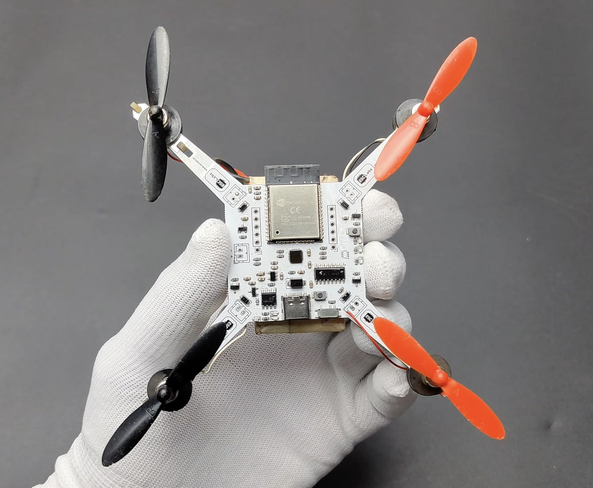
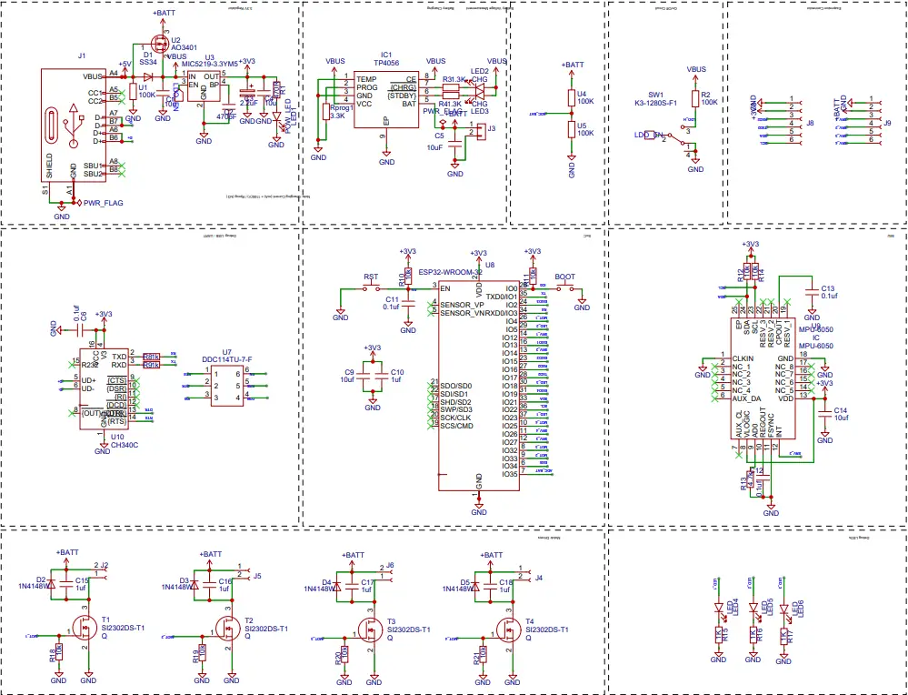

# Mini ESP32 Wi-Fi Drone

## Project origin

This project is **based on the tutorial by Rajesh K T (ESCLabs)**:

- 📘 Website tutorial:  
  https://www.esclabs.in/how-to-make-a-cheap-esp32-drone-under-15/

- 🎥 YouTube video walkthrough:  
  https://www.youtube.com/watch?v=X3m5shEr6eY

Below you’ll find a **high-level summary of the build steps**.  
For **full explanations, schematics reasoning, and detailed photos**, it is strongly recommended to consult the original tutorial.

All **relevant downloads** (BOM, firmware, schematics, Gerbers, app files) are provided in **this repository**.

---

## What this project is

A **very low-cost quadcopter drone** built around an **ESP32**, using:
- Wi-Fi + smartphone instead of an RC transmitter
- A **custom PCB** acting as both electronics and frame
- Brushed coreless motors driven directly via MOSFETs (no ESCs)

The focus is on **weight reduction, simplicity, and cost**.

---

## Build overview (summary)

## 0 Main components

Here is the link to the complete components list **`BOM.csv`**.

### 1. Understand the concept
- ESP32 handles control + Wi-Fi
- MPU6050 provides gyro + accelerometer data
- Custom PCB reduces weight and improves symmetry
- Motors are switched via MOSFETs (no ESCs)

---

### 2. Circuit & electronics
- ESP32-WROOM-32 as main controller
- MPU6050 connected via I²C (GPIO21 / GPIO22)
- USB-to-Serial (CH340C) for flashing
- 3.3 V regulation + Li-Po charging circuit
- 4 MOSFET motor drivers with protection diodes

---

### 3. PCB design
- Symmetrical quad layout
- PCB acts as the drone frame
- MPU6050 placed at the exact center
- Motor mounts integrated into the PCB outline

---

### 4. PCB fabrication
- Export Gerber files
- Order PCB (1.6 mm thickness recommended)
- Order SMT stencil for easy assembly

---

### 5. Assembly
- Apply solder paste using a stencil
- Place SMD components
- Reflow soldering (hot plate or equivalent)
- Inspect joints

---

### 6. Motors & propellers
- Mount coreless motors using rubber grommets
- Solder motors to PCB
- Install propellers (2× CW, 2× CCW)
- Correct orientation is critical

---

### 7. Battery
- 3.7 V or 3.8 V Li-Po
- **Very lightweight**
- **≥ 25C discharge rate** (essential)

---

### 8. Firmware flashing
- Put ESP32 into boot mode
- Flash firmware (flash address = 0)
- Reset after flashing

Firmware and source code are available in this repository.

---

### 9. Controller app
- Drone creates its own Wi-Fi network
- Connect phone to drone Wi-Fi
- Open the controller app
- Calibrate on a flat surface
- Adjust roll/pitch if needed

---

### 10. Testing
- Initial calibration on power-up
- Short hover tests
- Fine-tuning required for stable flight

---

## Repository contents

